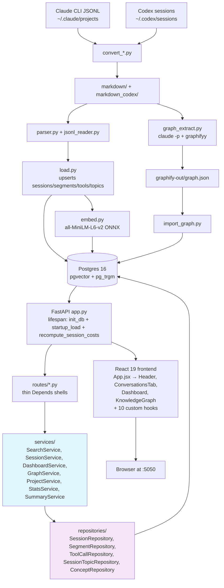

# LLM CLI Conversation Export & Browser

[](https://github.com/amrambouskila/llm-cli-conversation-export/actions/workflows/ci.yml)


Personal observability + recall platform for Claude/Codex CLI conversations — exports raw JSONL to Markdown, loads it into Postgres with hybrid semantic + keyword search, and renders a three-pane browser + KPI dashboard + knowledge graph, all in one Docker stack.

## Prerequisites

- **Docker Desktop** installed and running ([download](https://www.docker.com/products/docker-desktop/))
- **Python 3.10+** on PATH (for the export step only — the browser runs entirely in Docker)

## Quick Start

### macOS / Linux

```bash
./export_service.sh
```

### Windows

```cmd
export_service.bat
```

That's it. The script will:
1. Export conversations from `~/.claude/projects/` to `./markdown/`
2. Build the Docker image (React frontend + FastAPI backend)
3. Start the container on `http://localhost:5050`
4. Auto-open your browser
5. Wait for your shutdown choice

### Shutdown Options

Once the service is running, the script stays open and shows an interactive menu:

```
==============================
Service running at http://localhost:5050

Press k + Enter = stop but keep image
Press q + Enter = stop & remove image
Press v + Enter = stop, remove image, volumes & generated data
Press r + Enter = full reset & restart (wipe, re-export, rebuild)
==============================
```

| Key | Containers | Image | Volumes | Generated data | Restarts? |
|-----|-----------|-------|---------|----------------|-----------|
| `k` | Stopped | Kept | Kept | Kept | No |
| `q` | Removed | Removed | Kept | Kept | No |
| `v` | Removed | Removed | Removed | **Deleted** (`raw/`, `markdown/`, `markdown_codex/`, `browser_state/`) | No |
| `r` | Removed | Removed | Removed | **Deleted** | **Yes** — re-exports, rebuilds, relaunches |

**`v` is the nuclear wipe.** It removes everything generated — but never touches `~/.claude/projects/` (your source data).

**`r` is the nuclear wipe + restart.** Same as `v`, then immediately re-exports, rebuilds the Docker image, and relaunches the browser. One key for a complete fresh start.

### Startup Options

| Flag | Description |
|------|-------------|
| `--skip-export` | Start the browser without re-exporting (uses existing markdown) |
| `--export-only` | Export conversations only, don't start the browser |
| `project-name` | Only export projects matching this filter |

**Examples:**
```bash
# macOS/Linux
./export_service.sh                   # full export + start
./export_service.sh --skip-export     # quick restart (no re-export)
./export_service.sh --export-only     # export only
./export_service.sh oft               # export only "oft" projects

# Windows
export_service.bat
export_service.bat --skip-export
export_service.bat --export-only
```

**Custom port:**
```bash
PORT=8080 ./export_service.sh
```

## Directory Structure

```
llm-cli-conversation-export/
├── README.md
├── Dockerfile                         # Multi-stage: Node builds React, Python runs FastAPI
├── docker-compose.yml                 # Container config, mounts volumes
├── .dockerignore
├── .gitignore
├── export_service.sh                  # One-command startup (macOS/Linux)
├── export_service.bat                 # One-command startup (Windows)
├── summary_watcher.bat                # Windows summary watcher subprocess
├── convert_export.py                  # Cross-platform export script (Python)
├── convert_claude_jsonl_to_md.py      # Core JSONL-to-Markdown converter (Claude format)
├── convert_codex_sessions.py          # Codex session converter
├── raw/                               # Synced raw JSONL conversation data
│   ├── projects/                      # One subdirectory per project
│   └── manifest.txt                   # Index of all .jsonl files
├── markdown/                          # Generated Markdown files (Claude, one per project)
├── markdown_codex/                    # Generated Markdown files (Codex, one per session)
├── browser_state/                     # Host-side AI summary cache
│   └── summaries/                     # Cached AI-generated summaries
└── browser/
    ├── backend/
    │   ├── app.py                     # FastAPI application (lifespan, SPA serving)
    │   ├── db.py                      # SQLAlchemy async engine + FastAPI DI providers
    │   ├── models.py                  # SQLAlchemy 2.0 declarative models
    │   ├── schemas.py                 # Pydantic v2 request/response models
    │   ├── parser.py, load.py, embed.py, import_graph.py, graph_extract.py, …
    │   ├── routes/                    # APIRouters: projects, segments, conversations, stats, summaries, visibility, dashboard
    │   ├── services/                  # SearchService, SessionService, DashboardService, GraphService, ProjectService, StatsService, SummaryService + _filter_scope
    │   ├── repositories/              # SessionRepository, SegmentRepository, ToolCallRepository, SessionTopicRepository, ConceptRepository
    │   ├── tests/                     # 751 pytest tests — services/, repositories/, test_app_lifespan.py, test_load*.py, test_api_*.py, etc.
    │   ├── requirements.txt           # runtime deps (fastapi, sqlalchemy, asyncpg, pgvector, onnxruntime, tokenizers)
    │   └── requirements-dev.txt       # pytest, pytest-asyncio, pytest-cov, testcontainers, httpx, ruff
    └── frontend/
        ├── package.json               # React 19 + Vite 6 + Chart.js + d3
        ├── vite.config.js             # Dev proxy to FastAPI
        ├── vitest.config.js           # Per-file coverage thresholds (100% lines enforced)
        ├── eslint.config.js           # ESLint v9 flat config (react-hooks enforced)
        ├── index.html                 # Entry point
        └── src/
            ├── main.jsx
            ├── App.jsx                # Integration shell (post-7.3 decomposed)
            ├── App.css                # All styles (dark + light theme)
            ├── api.js                 # Fetch wrapper per endpoint
            ├── utils.js               # Formatting + markdown renderer
            ├── components/            # Header, SearchBar, FilterBar, ProjectsPane, RequestsPane, ContentPane, MetadataPane, ConversationsTab, Dashboard, KnowledgeGraph, ConceptGraph, Heatmap, Charts, SearchResults, FilterChips, ProjectList, RequestList, ContentViewer, SummaryPanel, MetadataPanel
            ├── hooks/                 # useBackendReady, useProviders, useTheme, useSummaryTitles, useKeyboardShortcuts, useResizeHandles, useProjectSelection, useSearch, useHideRestore, useCostBreakdown
            └── __tests__/             # 736 vitest tests mirroring components/ + hooks/
```

## Architecture



**Build pipeline (inside Dockerfile):**
1. Node 20 stage: `npm install` + `npm run build` → produces `dist/` with static React app
2. Python 3.13 stage: installs FastAPI + uvicorn + pgvector + onnxruntime, copies backend code + built React
3. At runtime: FastAPI serves both the API and the React SPA from a single process

**Markdown files are mounted read-write** so the Update button and watch mode can regenerate them.

**Cost calculation.** Per-session cost uses the 4-way formula `input × price + output × price + cache_read × 10% of input-price + cache_creation × 125% of input-price` (the `CACHE_WRITE_PREMIUM_5M = 1.25` in `load.py` applies Anthropic's 5-minute-TTL rate). Dashboard totals and `MetadataPane` per-session attribution both derive from the same pure function, so they stay consistent. Historical rows are re-scored on every app startup via `recompute_session_costs()`. See `docs/CONVERSATIONS_MASTER_PLAN.md` §5 for the full rationale.

## Testing

```bash
# Backend (containerized — needs Docker)
docker run --rm -v "$(pwd)/browser/backend:/app" -v /var/run/docker.sock:/var/run/docker.sock -w /app \
  -e TESTCONTAINERS_RYUK_DISABLED=true -e TESTCONTAINERS_HOST_OVERRIDE=host.docker.internal \
  python:3.13-slim bash -c "apt-get update -qq && apt-get install -y -qq --no-install-recommends libgomp1 gcc docker.io > /dev/null 2>&1 && pip install -q -r requirements.txt -r requirements-dev.txt && ruff check . && pytest --cov --cov-fail-under=100"

# Frontend
cd browser/frontend && npm ci && npm run lint && npm run test:coverage && npm run build
```

CI (`.github/workflows/ci.yml`) runs the same commands plus a multi-stage Docker build verification. Backend enforces `--cov-fail-under=100`. Frontend enforces per-file thresholds in `vitest.config.js` — every module at 100% lines, most at 100% branches + functions, with the remaining hard-to-reach inline JSX wrappers and Chart.js option callbacks held at their measured posture.

## How the Browser Works

### Three-Pane UI (resizable)

| Pane | Contents |
|------|----------|
| **Left** | Project list sorted by most recent activity, with request counts and expandable per-project stats. Click the "Projects" header to deselect and return to global view. |
| **Middle** | User request segments grouped by conversation (collapsible), with previews |
| **Right** | Full rendered Markdown for the selected segment, with search highlighting |
| **Top toolbar** | Copy/Download buttons for the current segment |
| **Bottom** | Metadata: timestamps, word/char/line/token counts, tool call count, source file |

Drag the handles between panes to resize them.

### Keyboard Shortcuts

| Key | Action |
|-----|--------|
| `Cmd/Ctrl + K` | Focus search bar |
| `Escape` | Clear search |
| `Arrow Up/Down` | Navigate between request segments |

### Search with Highlighting

Type in the search bar to search across all conversations. Results show project name, preview, and metrics. Minimum 2 characters. **Matching text is highlighted** in the content viewer when viewing a search result.

### Date Range Filtering

Click the **Dates** button next to the search bar to show date pickers. Set a date range and click **Apply** to filter. When active, the filter hides projects, conversations, and requests that fall outside the range. Click **Clear** to reset. Works alongside text search.

### Full Conversation View

Click the **Full** button on a conversation header in the middle pane to view all segments from that conversation concatenated in the right pane, with combined metrics.

### Export Segment

When viewing a segment or conversation, use the **Copy** or **Download** buttons in the content toolbar to export the raw markdown.

### Project-Level Statistics

Click the disclosure triangle on any project in the left pane to see per-project stats: conversation count, word count, estimated tokens, tool calls, and time span.

### Dark/Light Theme

Click the **Light**/**Dark** button in the header to toggle. Preference is saved in localStorage.

### Delete / Restore (Soft Delete)

Hide items you don't want to see without deleting the underlying data:

- **Segments:** Hover over a request in the middle pane and click the `x` button
- **Conversations:** Hover over a conversation header and click the `x` button
- **Projects:** Hover over a project in the left pane and click the `x` button

Hidden items are stored in `./browser_state/browser_state.json` (mounted as a Docker volume). They survive container restarts, re-exports, and image rebuilds.

To see and restore hidden items:
1. Click the **Trash** button in the header (shows a count badge when items are hidden)
2. Hidden items appear greyed out with a **Restore** button
3. Click **Restore All** to unhide everything at once

The `v` and `r` shutdown options wipe `browser_state/`, `raw/`, `markdown/`, and `markdown_codex/`.

Your source data in `~/.claude/projects/` is **never modified**.

### AI Summaries

The content viewer pane is split vertically: **top half** shows the raw markdown, **bottom half** shows an AI-generated summary.

**How it works:**
1. Click a request segment
2. The bottom half shows a loading bar while the summary is generated
3. Once complete, the summary is cached at `./browser_state/summaries/{id}.md`
4. Clicking the same segment again loads instantly from cache (no API call)

**Requires:** The `claude` CLI installed and authenticated on your machine. No API key needed.

**How it runs:** The startup script (`./export_service.sh`) launches a background watcher process on the host that:
- Watches `./browser_state/summaries/` for `.pending` files
- Runs `claude -p` (non-interactive print mode) to generate each summary
- Saves the output and cleans up the request files
- Gets killed automatically when you press k/q/v/r to stop the service

**Model:** Defaults to `claude-sonnet-4-6` for quality. Override with `SUMMARY_MODEL` env var:
```bash
SUMMARY_MODEL=claude-opus-4-6 ./export_service.sh
```

**If `claude` CLI is not installed:** The watcher won't start and you'll see a note in the terminal. The rest of the app works normally — summaries just show "unavailable."

## How the File Format Was Inferred

The parser was built by inspecting the actual Markdown files produced by `convert_claude_jsonl_to_md.py`. Key patterns discovered:

- **Project delimiter:** Each `.md` file = one project
- **User request delimiter:** `>>>USER_REQUEST<<<` on its own line
- **Entry heading format:** `# User #N — 2026-03-26T22:07:03.466Z — conv: \`uuid\``
- **Entry key:** `<!-- ENTRY_KEY: hash:... -->` HTML comment before each entry
- **Conversation separator:** `## Conversation \`uuid\` (started TIMESTAMP)`
- **Tool calls:** `**Tool Call: \`ToolName\`**` followed by ` ```json ` block
- **Timestamps:** ISO 8601 format (`YYYY-MM-DDTHH:MM:SS.sssZ`)
- **Quoted delimiters:** The converter neutralizes `>>>USER_REQUEST<<<` inside code blocks to `>>>USER_REQUEST [quoted]<<<`, preventing false matches

## Assumptions and Limitations

1. **Timestamps** are reliably extracted from the heading line after `>>>USER_REQUEST<<<`. Falls back to file order if absent.
2. **Token estimates** use a rough 4-chars-per-token approximation. Approximate for mixed English + code.
3. **Tool call count** is detected by counting `**Tool Call:` patterns in the Markdown. Reliable for the current converter output.
4. **Markdown rendering** uses a lightweight custom renderer (no external library). Complex nested Markdown may not render perfectly.
5. **Large files** (80K+ lines) are loaded into memory on startup. Fine for current volume (~4MB). SQLite index recommended if data grows 10x+.
6. **Raw export files are never modified.** The browser is read-only.
7. **Docker is required** for the browser. The export step runs natively with just Python.

## Cross-Platform Support

| Feature | macOS | Linux | Windows |
|---------|-------|-------|---------|
| `export_service.sh` | Yes | Yes | — |
| `export_service.bat` | — | — | Yes |
| `convert_export.py` | Yes | Yes | Yes |
| Docker browser | Yes | Yes | Yes |
| Auto-open browser | Yes | Yes | Yes |

The cross-platform `convert_export.py` replaces bash-specific `rsync` with Python's `shutil.copy2` and handles path differences automatically.

**Windows notes:**
- Requires Python 3.10+ and Docker Desktop
- `CLAUDE_CONFIG_DIR` env var can override the default `~/.claude` location
- The `.bat` script handles the full workflow identically to the `.sh` script

## Development (without Docker)

For local development with hot-reload:

```bash
# Terminal 1: FastAPI backend
cd browser/backend
pip install -r requirements.txt
MARKDOWN_DIR=../../markdown uvicorn app:app --reload --port 5050

# Terminal 2: React dev server (with API proxy to backend)
cd browser/frontend
npm install
npm run dev
```

The Vite dev server runs on `http://localhost:5174` and proxies `/api/*` to FastAPI at `:5050`.

## Implemented Features

- [x] **Global search with highlighting** — matching text highlighted in the content viewer
- [x] **Date range filtering** — filter segments by timestamp range via date pickers
- [x] **Project-level statistics** — expandable stats per project (tokens, conversations, time span)
- [x] **Full conversation view** — click "Full" on a conversation header to view all segments together
- [x] **Export selected segment** — Copy to clipboard or Download as .md file
- [x] **Source file display** — source filename shown in the content toolbar
- [x] **Resizable panes** — drag handles between all three panes
- [x] **Dark/light theme toggle** — persisted in localStorage
- [x] **Watch mode** — auto-reload when markdown files change on disk (30s poll, configurable)
- [x] **Delete / Restore** — soft-delete segments, conversations, or projects with a Trash view to restore
- [x] **AI Summaries** — AI-generated summaries in a split content pane, cached to disk, no API key needed
- [x] **Multi-provider support** — browse Claude and Codex conversations with a provider dropdown
